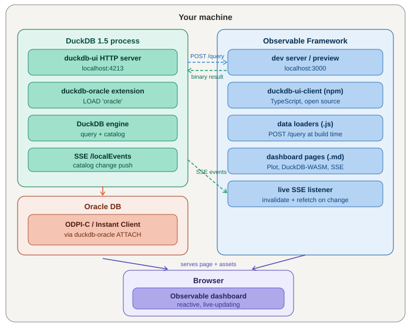

# framework-oracle-dashboard

> DuckDB 1.5 · duckdb-oracle · Observable Framework

Architecture & developer guide for the Oracle-backed Observable Framework dashboard, using the `duckdb-ui` HTTP server as the query backend.

---

## Table of contents

1. [Overview](#1-overview)
2. [Architecture](#2-architecture)
3. [Prerequisites](#3-prerequisites)
4. [Quick start](#4-quick-start)
5. [Project structure](#5-project-structure)
6. [Key files explained](#6-key-files-explained)
7. [Configuration](#7-configuration)
8. [Protocol notes](#8-protocol-notes)
9. [Upgrading DuckDB](#9-upgrading-duckdb)

---

## 1. Overview

This project connects an [Observable Framework](https://observablehq.com/framework/) dashboard to an Oracle database via **DuckDB 1.5** and the custom **duckdb-oracle** extension. The `duckdb-ui` HTTP server acts as the query backend, replacing the need for a separate Express sidecar.

Key design goals:

- **No Docker, no separate database process** — DuckDB runs in-process on the local machine.
- **Static snapshots for instant page loads** — Observable Framework data loaders query DuckDB at build/preview time and cache the results as JSON.
- **Live schema-change notifications** — the `duckdb-ui` `/localEvents` SSE endpoint pushes catalog changes to the browser automatically.
- **Oracle owned by DuckDB** — the Oracle connection is managed entirely through the `duckdb-oracle` `ATTACH` syntax using ODPI-C / Instant Client.

---

## 2. Architecture



### Component summary

| Component | Role |
|---|---|
| **DuckDB 1.5 process** | Runs in-process on the local machine. Loads the oracle extension, attaches Oracle DB, and serves the `duckdb-ui` HTTP server on port 4213. |
| **duckdb-oracle extension** | Custom C++ DuckDB extension (built against v1.5 headers) that exposes Oracle tables via `ATTACH` using ODPI-C / Instant Client. |
| **duckdb-ui HTTP server** | Embedded HTTP server (port 4213). Exposes `POST /query`, `GET /localEvents` (SSE), and a proxy for UI assets from `ui_remote_url`. |
| **Observable Framework** | Static site generator. Data loaders run in Node.js at build/preview time and `POST` queries to `/query`. Dashboard pages are Markdown + reactive JS. |
| **SSE `/localEvents`** | Server-Sent Events stream pushed by `duckdb-ui` whenever the DuckDB catalog changes (table created, dropped, etc.). The browser subscribes and invalidates cached data. |
| **Browser** | Loads the Observable dashboard. Subscribes to SSE, runs live queries, renders charts and tables with Observable Plot. |

### Data flow

```
Oracle DB
   │  ODPI-C / Instant Client
   ▼
DuckDB 1.5 process (port 4213)
   ├─ POST /query  ◄────────────────── Node.js data loaders (build time)
   ├─ GET  /localEvents (SSE) ───────► Browser (live, invalidate on change)
   └─ GET  /* → proxy → :3000 ◄──────  ui_remote_url = Observable Framework

Observable Framework (port 3000)
   ├─ data loaders → fetch /query
   └─ dashboard pages → browser
         └─ EventSource /localEvents
```

---

## 3. Prerequisites

- **Node.js 20+**
- **DuckDB v1.5** CLI binary (`duckdb`)
- **`duckdb_oracle.duckdb_extension`** compiled against v1.5 headers — see [rinie/duckdb-oracle](https://github.com/rinie/duckdb-oracle)
- **Oracle Instant Client** on `LD_LIBRARY_PATH` (Linux/macOS) or `PATH` (Windows)

> **ABI lock:** The `duckdb_oracle.duckdb_extension` binary is version-locked to the DuckDB ABI. A v1.4-compiled extension will be refused by a v1.5 DuckDB process. Always rebuild the extension when upgrading DuckDB.

---

## 4. Quick start

### 4.1 Edit `startup.sql`

Set the path to your oracle extension and your Oracle DSN:

```sql
LOAD '/path/to/duckdb_oracle.duckdb_extension';
ATTACH 'user/pass@//oracle-host:1521/MYDB' AS oracle (TYPE oracle);
```

### 4.2 Start DuckDB

```bash
duckdb -init startup.sql my-data.db
```

The `duckdb-ui` server starts on `http://localhost:4213`. Because `startup.sql` sets `ui_remote_url = 'http://localhost:3000'`, UI asset requests are proxied from Observable Framework.

### 4.3 Start Observable Framework

```bash
npm install
npm run dev
```

Framework starts on `http://localhost:3000`. Data loaders execute at startup, querying DuckDB via `/query`. Open `http://localhost:3000` in your browser.

---

## 5. Project structure

```
framework-oracle-dashboard/
├── package.json                   @duckdb/node-api 1.5, @observablehq/framework 1.9
├── observablehq.config.js         pages, root, output directory
├── startup.sql                    DuckDB init — loads oracle ext, starts UI server
├── README.md
├── docs/
│   ├── ARCHITECTURE.md            this file
│   └── architecture.png           architecture diagram
└── src/
    ├── index.md                   home page: static snapshot + live SSE
    ├── oracle-tables.md           interactive schema/table explorer
    ├── components/
    │   └── duckdb-ui.js           shared query helper (Node.js + browser)
    └── data/
        ├── oracle-tables.json.js  data loader: Oracle table list
        └── oracle-sample.json.js  data loader: sample table rows
```

| File | Purpose |
|---|---|
| `startup.sql` | DuckDB init — loads oracle ext, sets `ui_remote_url`, calls `start_ui_server()` |
| `observablehq.config.js` | Framework config — pages, root, output directory |
| `package.json` | npm deps: `@observablehq/framework`, `@duckdb/node-api` |
| `src/components/duckdb-ui.js` | Shared JS module: `query()`, `getCatalog()`, `subscribeToCatalogEvents()` |
| `src/data/oracle-tables.json.js` | Data loader: fetches Oracle table list at build time → static JSON |
| `src/data/oracle-sample.json.js` | Data loader: fetches sample rows from a configurable Oracle table |
| `src/index.md` | Home page — static snapshot + live SSE-driven table list |
| `src/oracle-tables.md` | Interactive Oracle table explorer with schema/table selectors |

---

## 6. Key files explained

### `startup.sql`

Loaded by the DuckDB CLI via `-init startup.sql`. Sets up everything before the REPL starts:

```sql
SET allow_unsigned_extensions = true;   -- required for ui_remote_url override
LOAD '/path/to/duckdb_oracle.duckdb_extension';
ATTACH 'user/pass@//host:1521/SID' AS oracle (TYPE oracle);
SET ui_remote_url = 'http://localhost:3000';  -- proxy assets from Framework
CALL start_ui_server();
```

> `allow_unsigned_extensions = true` is required for `ui_remote_url` to take effect. Without it, DuckDB ignores the override and proxies from `https://ui.duckdb.org`.

### `src/components/duckdb-ui.js`

Thin `fetch()` wrapper around the `duckdb-ui` HTTP API. Works in both Node.js (data loaders) and the browser (live queries).

```js
import { query, subscribeToCatalogEvents } from "./components/duckdb-ui.js";

// In a data loader (Node.js):
const rows = await query("SELECT * FROM oracle.EMPLOYEES LIMIT 100");

// In a dashboard page (browser):
const unsub = subscribeToCatalogEvents((event) => {
  console.log("catalog changed", event.data);
});
```

Exports:

| Export | Description |
|---|---|
| `query(sql)` | `POST /query`, normalises response to `Array<Record<string, unknown>>` |
| `getCatalog()` | Convenience wrapper — queries `information_schema.tables` for the `oracle` catalog |
| `subscribeToCatalogEvents(fn)` | Opens `EventSource` on `/localEvents`, returns an unsubscribe function |

### Data loaders (`src/data/*.json.js`)

Files named `*.json.js` in `src/data/` are Observable Framework **data loaders** — they run in Node.js at `observable build` or `observable preview` time and write JSON to `stdout`. Framework caches the result in `.observablehq/cache/`.

This gives instant page loads without a live database connection in the browser.

```js
// src/data/oracle-tables.json.js
import { query } from "../components/duckdb-ui.js";

const tables = await query(`
  SELECT table_schema, table_name, table_type
  FROM information_schema.tables
  WHERE table_catalog = 'oracle'
  ORDER BY table_schema, table_name
`);

process.stdout.write(JSON.stringify(tables));
```

In a dashboard page, load the snapshot with:

```js
const oracleTables = FileAttachment("data/oracle-tables.json").json();
```

### Live SSE in `src/index.md`

The home page uses `Generators.observe()` to subscribe to `/localEvents`. Every SSE event bumps a version counter which invalidates and re-runs the live query, reflecting Oracle schema changes without a page reload:

```js
const catalogVersion = Generators.observe((notify) => {
  let version = 0;
  notify(version);
  const es = new EventSource("http://localhost:4213/localEvents");
  es.onmessage = () => notify(++version);
  return () => es.close();
});

// Re-runs every time catalogVersion ticks
const liveRows = catalogVersion, await fetch("http://localhost:4213/query", {
  method: "POST",
  headers: { "Content-Type": "application/json" },
  body: JSON.stringify({ sql: "SELECT * FROM information_schema.tables WHERE table_catalog = 'oracle'" })
}).then(r => r.json()).then(({ columns, rows }) => {
  const names = columns.map(c => c.name);
  return rows.map(row => Object.fromEntries(names.map((n, i) => [n, row[i]])));
});
```

---

## 7. Configuration

### Environment variables

| Variable | Default | Description |
|---|---|---|
| `DUCKDB_UI_URL` | `http://localhost:4213` | Base URL of the `duckdb-ui` server, used by data loaders |
| `ORACLE_SAMPLE_TABLE` | `oracle.EMPLOYEES` | Table queried by the `oracle-sample` data loader |

### DuckDB settings (in `startup.sql`)

| Setting | Value | Description |
|---|---|---|
| `allow_unsigned_extensions` | `true` | Required for `ui_remote_url` override to take effect |
| `ui_remote_url` | `http://localhost:3000` | Proxies UI asset requests to Observable Framework dev server |

---

## 8. Protocol notes

### `POST /query`

Request body (JSON):

```json
{ "sql": "SELECT * FROM oracle.MY_TABLE LIMIT 10" }
```

Response body (JSON):

```json
{
  "columns": [{ "name": "ID", "type": "INTEGER" }, { "name": "NAME", "type": "VARCHAR" }],
  "rows": [[1, "Alice"], [2, "Bob"]]
}
```

The `duckdb-ui-client` TypeScript package (open source, in the `duckdb/duckdb-ui` monorepo) handles the binary `BinarySerializer` format for large result sets. For data loader use, plain JSON is sufficient.

### `GET /localEvents` (SSE)

Standard `EventSource` stream. Each message is a JSON payload describing the catalog event type (e.g., table created, schema dropped). The browser subscriber does not need to parse the payload — any event is sufficient to trigger a refetch.

### `ui_remote_url` proxy

When a browser `GET`s `http://localhost:4213/`, the `duckdb-ui` server fetches the response from `ui_remote_url` and proxies it back to the browser. Setting `ui_remote_url = 'http://localhost:3000'` causes DuckDB to forward all asset requests to Observable Framework instead of `https://ui.duckdb.org`.

Requires `allow_unsigned_extensions = true`.

---

## 9. Upgrading DuckDB

When upgrading from one DuckDB minor version to another:

1. **Rebuild `duckdb_oracle.duckdb_extension`** against the new DuckDB version headers — extension ABI is version-locked.
2. **Update `@duckdb/node-api`** in `package.json` to match the new DuckDB version (e.g., `^1.5.0-r.1` for v1.5).
3. **Check the `ui` extension version** — it may lag the core release by a few days after a new DuckDB minor is published.
4. **Test the Oracle ATTACH** after upgrading — type mapping or catalog query behaviour may have changed.
